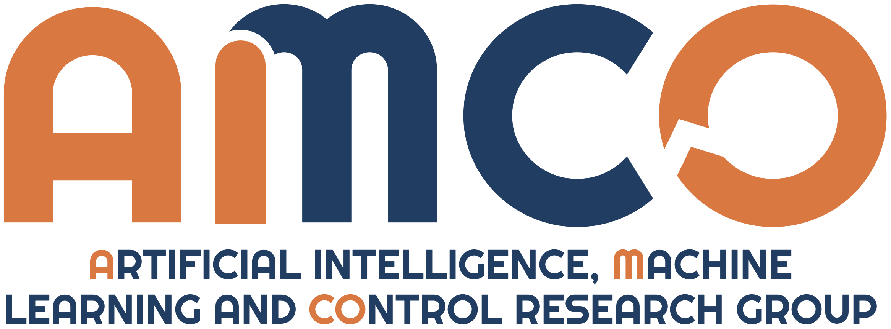

# A Distributed Approach to Autonomous Intersection Management via Multi-Agent Reinforcement Learning
## Matteo Cederle, Marco Fabris and Gian Antonio Susto
#### Department of Information Engineering, University of Padova, 35131 Padua via Gradenigo 6/B, Italy



### Abstract
Autonomous intersection management (AIM) poses significant challenges due to the intricate nature of real-world traffic scenarios and the need for a highly expensive centralised server in charge of simultaneously controlling all the vehicles. This study addresses such issues by proposing a novel distributed approach to AIM utilizing multi-agent reinforcement learning (MARL). We show that by leveraging the 3D surround view technology for advanced assistance systems, autonomous vehicles can accurately navigate intersection scenarios without needing any centralised controller. The contributions of this paper thus include a MARL-based algorithm for the autonomous management of a 4-way intersection and also the introduction of a new strategy called prioritised scenario replay for improved training efficacy. 
We validate our approach as an innovative alternative to conventional centralised AIM techniques, ensuring the full reproducibility of our results. Specifically, experiments conducted in virtual environments using the SMARTS platform highlight its superiority over benchmarks across various metrics.

## How to train and evaluate the algorithm
1. Clone the repository
2. [Set up SMARTS (Scalable Multi-Agent Reinforcement Learning Training School)](https://smarts.readthedocs.io/en/latest/setup.html)

   [SMARTS repository](https://github.com/huawei-noah/SMARTS), [SMARTS paper](https://arxiv.org/abs/2010.09776)

   
3. Build the scenarios:
   ```
   scl scenario build-all scenarios/sumo/multi_scenario/
   ```
4. Train the agents: 
   ```
   # You can optionally set the seed by adding --seed x, where x is the chosen seed (default 0)
   scl run main.py --headless
   ```
5. After the agents have been trained you can evaluate the results and visualize the simulation:
   ```
   # You can optionally set the seed by adding --seed x, where x is the chosen seed (default 0)
   scl run --envision main.py --load_checkpoint
   ```
6. To collect the data needed to evaluate the metrics presented in the paper run this for MAD4QN-PS:
   ```
   ./data_collection.sh
   ```
   For the random policy run instead:
   ```
   ./data_collection_random.sh
   ```
   The data for the other baselines are stored in the folder baselines
7. To plot the results, use the notebook plots.ipynb

## Cite this work
If you our work interesting for your research, please cite the [paper](https://arxiv.org/abs/2405.08655). In BibTeX format:

```bibtex
@misc{cederle2024distributed,
      title={A Distributed Approach to Autonomous Intersection Management via Multi-Agent Reinforcement Learning}, 
      author={Matteo Cederle and Marco Fabris and Gian Antonio Susto},
      year={2024},
      eprint={2405.08655},
      archivePrefix={arXiv},
      primaryClass={cs.RO}
}
```
